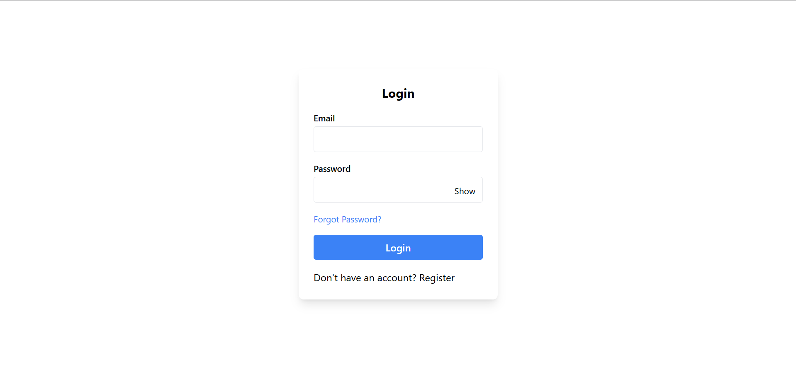
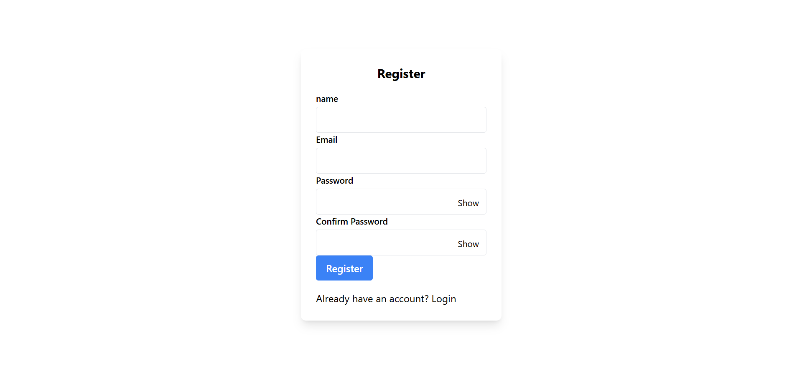
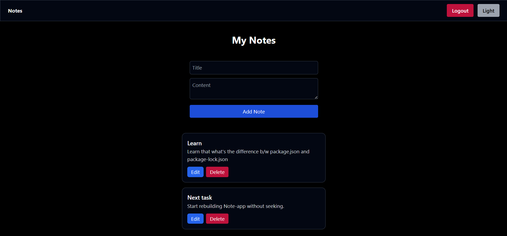

# 📝 Notes Web App (MERN)

A full-stack Notes Web Application built using the MERN stack with secure authentication, email verification, and password reset functionality.

---

## 🧧🧧 Features

* 🔐 JWT Authentication
* 📧 Email Verification
* 🔁 Resend Verification Email
* 🔑 Forgot & Reset Password
* 🛡️ Rate Limiting (Security)
* 🧾 User-specific Notes
* ✏️ Create, Read, Update, Delete (CRUD)
* 🔒 Protected Routes
* 🌙 Dark Mode UI
* ⚡ Toast notifications for feedback

---

## 🛠️ Tech Stack

**Frontend**
* React (Vite)
* Tailwind CSS

**Backend**
* Node.js
* Express.js

**Database**
* MongoDB (Mongoose)

**Other**
* JWT (Authentication)
* Nodemailer (Emails)
* Joi (Validation)
* Express Rate Limit

---

## 🌐 Live Demo

🧧 Frontend: https://note-app-omega-pied.vercel.app/  
🧧 Backend: https://dashboard.render.com/project/prj-d7dneln41pts73a5dfqg

---

## ⚙️ Setup Instructions

### 1. Clone the repository

```bash
git clone https://github.com/nitin01924/note-app.git
cd note-app 
```
### 2. Setup Backend
```bash
cd Backend
npm install
```
## Create a .env file inside Backend:
PORT=3000
MONGO_URI=your_mongodb_connection_string
JWT_SECRET=your_secret_key
EMAIL_USER=your_email
EMAIL_PASS=your_app_password
CLIENT_URL=http://localhost:5173

## Run backend:
```bash
npm run dev
```
## 3. Setup Frontend
```bash
cd Frontend
npm install
```
## Create a .env file inside Frontend:
```bash
VITE_API_URL=http://localhost:3000/api
```
## Run frontend:
```bash
npm run dev
```

## 📸 Screenshots

### Login


### Register


### Notes Dashboard


## 📌 Notes
* Password reset tokens are securely hashed
* Rate limiting is applied on authentication routes
* Centralized error handling implemented
* Production-ready authentication flow
* Make sure MongoDB is running or use MongoDB Atlas

## 👨‍💻 Author

### 
🧧 Nitin : nitin981275@gmail.com

🔖 GitHub: https://github.com/nitin01924
